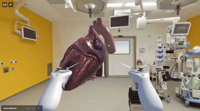
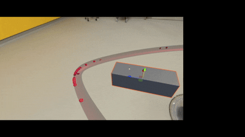
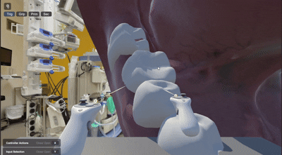
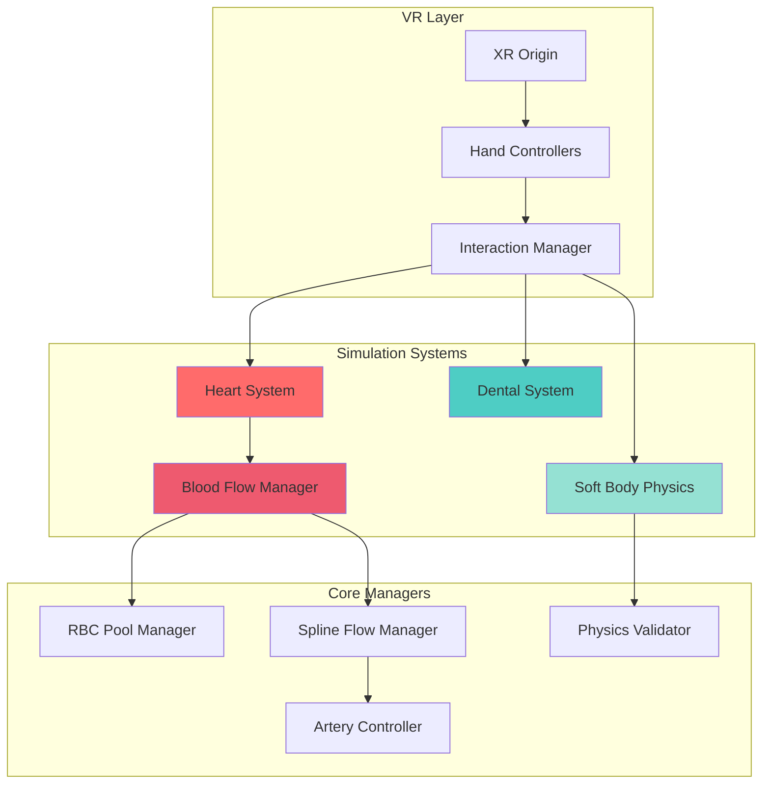

<div align="center">

# 🏥 VRMedSim

### Virtual Reality Medical Simulation
[](https://unity.com/)
[](LICENSE)
[](https://www.khronos.org/openxr/)
[](https://docs.unity3d.com/Packages/com.unity.xr.interaction.toolkit@2.0/manual/index.html)

*A VR medical training simulation featuring realistic soft-body physics, cardiovascular visualization, and interactive dental procedures.*

[Features](#-features) • [Getting Started](#-getting-started) • [Documentation](#-documentation) • [Contributing (to be added)](#-contributing)

</div>

---

### 🫀 Cardiovascular System

#### Heart Beat deformation


#### Blood Flow Dynamics

---

### 🦷 Dental Procedures

#### Interactive Tooth Extraction


---

### 🩸 Soft Body Physics

#### Real-Time Tissue Deformation
###### Simulating the nasal endoscope surgery 


---

#### Surgical Cutting Mechanics


---

## ✨ Features

### 🫀 **Cardiovascular Simulation**
- **Realistic Heart Beating**: Procedural heart deformation with customizable BPM
- **Blood Flow Visualization**: Object-pooled RBC particles with spline-based flow
- **Arterial System**: Procedurally generated coronary arteries using Unity Splines
- **Interactive Exploration**: Grab, rotate, and examine the cardiovascular system in 3D space

### 🦷 **Dental Simulation**
- **Tooth Extraction**: State-machine controlled extraction mechanics
- **Haptic Feedback**: Realistic force feedback during procedures
- **Prosthetic Placement**: Precision snap-to-socket tooth replacement
- **Audio Integration**: Contextual sound effects for enhanced immersion

### 🧬 **Soft Body Physics**
- **GPU-Accelerated Simulation**: High-performance deformable body physics
- **Surgical Cutting**: Real-time mesh manipulation for incisions
- **Tissue Interaction**: Touch, squeeze, and manipulate soft tissues
- **Performance Optimized**: Maintains 90+ FPS in VR

### 🎮 **VR Interaction**
- **Full Hand Tracking**: Powered by Unity XR Interaction Toolkit
- **Natural Gestures**: Grab, pinch, and manipulate objects intuitively
- **Locomotion System**: Smooth teleportation and continuous movement
- **Cross-Platform**: Compatible with Oculus Quest, HTC Vive, Valve Index, and more

---

## 🏗️ Architecture



---

## 🔧 Technical Details
### Performance

- **Frame Rate**: ~200 FPS (Tested on multiple mid-range laptops)
- **RBC Pool Size**: 10,000 objects (configurable)
- **Physics Update**: Fixed timestep at 50Hz
- **Draw Calls**: Optimized through batching and pooling
- **Memory**: <300MB VRAM

---

## 🚀 Getting Started

### Prerequisites

- **Unity Version**: 6.2.13f1
- **VR Headset**: Oculus Quest 2/3, HTC Vive, Valve Index, or OpenXR compatible device
- **Platform**: Windows 10/11 (Sofa Unity doesn't support Linux or MacOS)
- **Hardware**: 
  - GPU: NVIDIA GTX 1060 / AMD RX 580 or better
  - RAM: 16GB minimum
  - CPU: Intel i5-7th gen / AMD Ryzen 5 or better

### Installation

1. **Clone the Repository**
   ```bash
   git clone https://github.com/yourusername/VRMedSim.git
   cd VRMedSim
   ```

2. **Open in Unity**
   - Launch Unity Hub
   - Click "Add" → Select the `VRMedSim` folder
   - Ensure Unity 6.2.13f1 is installed
   - Open the project

3. **Install Dependencies**
   
   The following packages will be automatically installed via `Packages/manifest.json`:
   - Unity XR Interaction Toolkit
   - Universal Render Pipeline (URP)
   - TextMesh Pro
   - Splines

   If any packages are missing:
   - Open `Window` → `Package Manager`
   - Install: `XR Interaction Toolkit`, `Universal RP`

4. **Configure XR**
   - Go to `Edit` → `Project Settings` → `XR Plug-in Management`
   - Enable your VR platform (Oculus, OpenXR, etc.)
   - Configure interaction layers in `XR Interaction Toolkit` settings

5. **Run the Simulation**
   - Open `Assets/Scenes/Main.unity`
   - Connect your VR headset
   - Press `Play` ▶️
   - Put on your headset and start exploring!

---
## 🎮 Controls

### VR Controllers

| Action | Input | Description |
|--------|-------|-------------|
| **Grab** | Grip Button | Pick up and hold objects |
| **Activate** | Trigger | Interact with UI and tools |
| **Teleport** | Thumbstick + Release | Move to pointed location |
| **Rotate Object** | Grip + Move Controller | Rotate held objects |
| **Release** | Release Grip | Drop held object |

---

## 👨‍💻 Development

### Building the Project

```bash
# Development Build (with debug symbols)
File → Build Settings → Select Platform → Build

# Release Build
File → Build Settings → Development Build [OFF] → Build
```
### Adding New Simulations

1. Create your simulation in a separate work scene
2. Follow the prefab structure in `Plan/integration_guide.md`
3. Ensure all dependencies are properly assigned
4. Test in isolation before integration
5. Create a prefab in `Assets/Prefabs/`
6. Add to `MasterScene.unity`
---

## 👥 Team & Contributions

### Contributors

| Role | Focus Area | Components |
|------|-----------|------------|
| **Ziad Ashraf** | Soft Body | Flesh simulation, cutting mechanics |
| **Hakeem Taha** | Dental Simulation | Tooth extraction, prosthetics, haptic feedback |
| **Ahmed Anan** | Cardiovascular | Heart animation, arterial network, RBC visualization, blood vessel system |

### Contributing

We welcome contributions! Please follow these steps:

1. Fork the repository
2. Create a feature branch (`git checkout -b feature/AmazingFeature`)
3. Commit your changes (`git commit -m 'Add some AmazingFeature'`)
4. Push to the branch (`git push origin feature/AmazingFeature`)
5. Open a Pull Request

Please read [CONTRIBUTING.md](CONTRIBUTING.md) for detailed guidelines. (To be added)

---

## 🗺️ Roadmap

### ✅ Completed
- [x] Basic VR interaction system
- [x] Heart deformation and beating animation
- [x] RBC flow visualization with spline-based paths
- [x] Dental extraction mechanics
- [x] Soft body physics foundation
- [x] Object pooling optimization

### 🚧 In Progress
- [ ] Advanced surgical cutting with mesh splitting
- [ ] Realistic blood particle physics
- [ ] Multi-user collaboration mode
- [ ] Performance optimization for mobile VR

### 🔮 Future Plans
- [ ] Additional organ systems (lungs, kidneys, brain)
- [ ] Training scenarios with guided tutorials
- [ ] Performance analytics and tracking
- [ ] Integration with medical imaging (CT/MRI)
- [ ] Haptic glove support
- [ ] AI-driven patient simulation

---

## 📚 Documentation

Detailed documentation is available in the `Plan/` directory:

- **[Integration Guide](Plan/integration_guide.md)** - Team collaboration and Git workflow
- **[Flesh & Blood System](Plan/member1_flesh_blood.md)** - Soft body physics implementation
- **[Dental System](Plan/member2_teeth.md)** - Tooth extraction mechanics
- **[Cardiovascular System](Plan/member3_heart.md)** - Heart and blood flow simulation

---

## 📄 License

This project is licensed under the MIT License - see the [LICENSE](LICENSE) file for details.

```
MIT License

Copyright (c) 2025 VRMedSim Contributors

Permission is hereby granted, free of charge, to any person obtaining a copy
of this software and associated documentation files (the "Software"), to deal
in the Software without restriction, including without limitation the rights
to use, copy, modify, merge, publish, distribute, sublicense, and/or sell
copies of the Software, subject to permit persons to whom the Software is
furnished to do so.
```

---

## 🙏 Acknowledgments

- **Unity Technologies** - For the incredible XR Interaction Toolkit
- **Medical Community** - For invaluable feedback on anatomical accuracy
- **Open Source Contributors** - For physics engines and shader libraries
- **VR Community** - For testing and feature suggestions

---

<div align="center">

### 🌟 Star this repository if you find it helpful!

**Made with ❤️ for the future of medical education**

[Report Bug](https://github.com/AhmadEnan/VRMedSim/issues) • [Request Feature](https://github.com/AhmadEnan/VRMedSim/issues) • [Documentation](Plan/)

</div>
